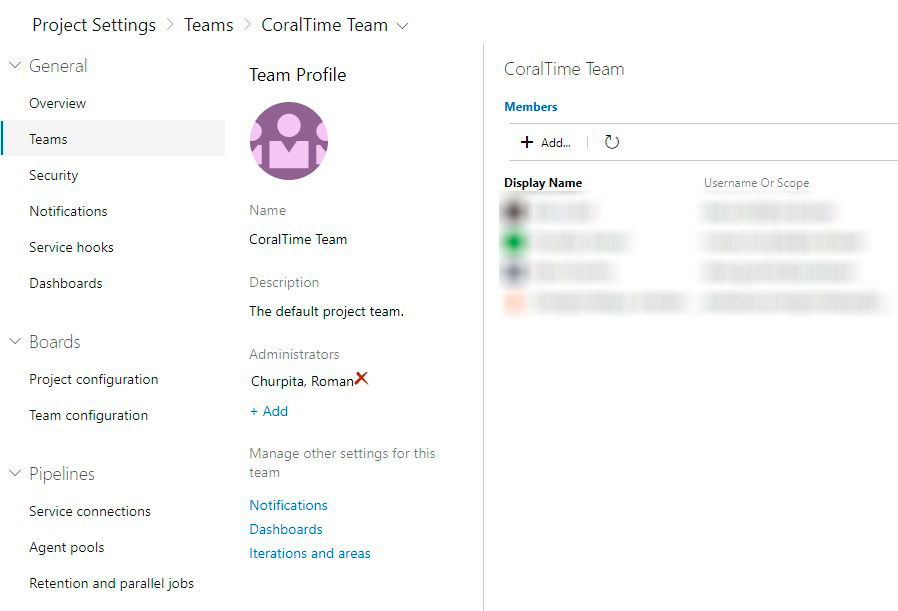

# CoralTime Extension for VSTS

### Quick steps to get started ###

1. Install [CoralTime](https://github.com/CoralTime/CoralTime).

2. Install extension. Configure your projects and clients in <code>[account].visualstudio.com website</code>.

3. Go to <code>user settings -> Personal access tokens</code>, create new API token.

4. Choose a work item to start your work and click in <strong>CoralTime</strong> tab.
Enter domain of your CoraTime website (you need to do this only once per project).

    > You have to be Team Administrator, to change this field. It can be configured in <code>project settings -> teams</code>.
    

5. Go to <code>vsts-integration page</code> in CoralTime site. Create new connection. Paste token in VSTS pat field.

## Contributors

We thank the following contributor(s) for this widget: Denis Gavrilov, Roman Churpita

## Feedback

We need your feedback! Here are some ways to connect with us:

- Add a comment in the Q&A section below and please add an actionable review.
- [GitHub Repository](https://github.com/CoralTime/CoralTime/tree/vsts-extension/vsts-extension/VstsExtension)
- Send us an [email](mailto://denis.gavrilov@coralteq.com).
